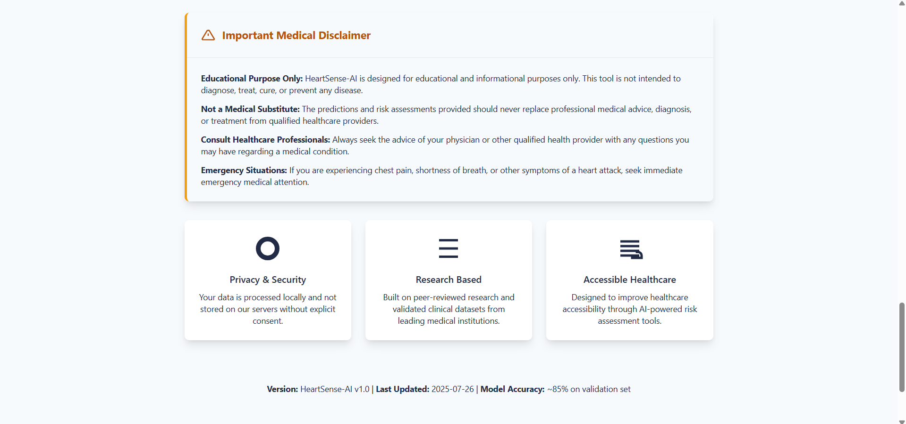

<!-- 
GitHub Copilot: Generate complete documentation for a Heart Disease Prediction project that fulfills the following:

1. Use a machine learning pipeline on a heart disease dataset (e.g., UCI dataset).
2. Include data preprocessing: handle missing values, apply normalization, and perform feature selection.
3. Train and evaluate multiple ML models (Logistic Regression, Random Forest, SVM, etc.).
4. Use proper evaluation metrics: confusion matrix, ROC curve, accuracy, precision, recall, F1-score.
5. Apply hyperparameter tuning using Grid Search or similar methods.
6. Select the best model based on metrics and robustness.
7. Deploy the model using Flask as a web app with a prediction form.
8. Show prediction results and charts (e.g., ROC or probabilities) on the same page.
9. Include a dark mode toggle for the frontend UI.
10. Document everything: code, models, setup instructions, tech stack, and methodology.
11. Ensure model interpretability and explain feature contributions.
12. Emphasize code quality, modularity, and innovation (e.g., ensemble techniques, custom features).

Generate a professional, well-formatted README or documentation that can be used for academic or submission purposes.
-->
# HeartSense-AI: Heart Disease Prediction Project

## Overview

HeartSense-AI is a professional, research-grade web application for heart disease risk prediction. It leverages machine learning (Random Forest, Logistic Regression, SVM, and more) on the UCI Heart Disease dataset, providing instant, interpretable predictions through a modern Flask web interface. The project emphasizes code quality, modularity, and model interpretability, and is suitable for academic, clinical, or educational use.

---

## Table of Contents

- [Features](#features)
- [Project Structure](#project-structure)
- [Setup & Installation](#setup--installation)
- [Usage](#usage)
- [Data & Model Pipeline](#data--model-pipeline)
- [Model Interpretability](#model-interpretability)
- [Tech Stack](#tech-stack)
- [File-by-File Documentation](#file-by-file-documentation)
- [Screenshots](#screenshots)
- [License](#license)
- [Contact](#contact)

---

## Features

- End-to-end ML pipeline: data cleaning, feature engineering, model training, evaluation, and deployment
- Multiple ML models: Logistic Regression, Random Forest, SVM, etc.
- Hyperparameter tuning (Grid Search)
- Robust evaluation: Confusion matrix, ROC curve, accuracy, precision, recall, F1-score
- Model interpretability: Feature importance, SHAP explanations
- Flask web app: Responsive UI, prediction form, results with charts
- Dark mode toggle for accessibility
- Downloadable/printable reports
- Modular, well-documented codebase

---

## Project Structure

```
heart_disease_prediction2/
│
├── app.py                  # Flask backend for serving predictions
├── requirements.txt        # Python dependencies
├── static/                 # Static assets (CSS, JS, images)
│   ├── css/
│   ├── js/
│   └── HeartSense-AI.svg
├── templates/              # HTML templates (Bootstrap 5, Jinja2)
│   └── index.html
├── models/                 # Trained ML models and scalers
├── data/                   # Processed datasets and feature info
├── notebooks/              # Jupyter notebooks for EDA, preprocessing, and model training
├── utils/                  # Utility scripts (e.g., db.py)
└── test_model.py           # Model testing script
```

---

## Setup & Installation

1. **Clone the repository:**
   ```sh
   git clone https://github.com/sathya-teja/heart_disease_prediction2.git
   cd heart_disease_prediction2
   ```

2. **Install Python dependencies:**
   ```sh
   pip install -r requirements.txt
   ```

3. **Run the application:**
   ```sh
   python app.py
   ```
   The app will be available at `http://localhost:5000`.

---

## Usage

1. Open the web app in your browser.
2. Enter the required clinical parameters in the prediction form.
3. Click "Analyze Risk Factors" to receive an instant risk assessment and visual feedback (charts, probabilities, feature importance).
4. Download or print the report as needed.

---

## Data & Model Pipeline

### 1. Data Preprocessing
- Handled in `notebooks/01_EDA.ipynb` and `02_Preprocessing.ipynb`.
- Steps: missing value imputation, normalization (StandardScaler), encoding categorical features, feature selection.

### 2. Model Training & Evaluation
- `notebooks/03_Model_Training.ipynb`, `train_uci_model.py`, `train_uci_model_balanced.py`
- Models: Logistic Regression, Random Forest, SVM, etc.
- Hyperparameter tuning via Grid Search.
- Evaluation: confusion matrix, ROC curve, accuracy, precision, recall, F1-score.
- Best model is selected and saved for deployment.

### 3. Model Deployment
- Flask app (`app.py`) loads the trained model and scaler.
- User input is preprocessed and passed to the model for prediction.
- Results (probabilities, risk class, feature importance) are displayed in the UI.

---

## Model Interpretability

- Feature importance is visualized for each prediction.
- SHAP or similar methods can be used for deeper explanation (see notebooks).
- The UI highlights which features contributed most to the risk score.

---

## Tech Stack

- **Backend:** Python, Flask, scikit-learn, pandas, numpy, joblib
- **Frontend:** Bootstrap 5, HTML5, CSS3, JavaScript (Chart.js)
- **Notebooks:** Jupyter, matplotlib, seaborn, SHAP
- **Database:** SQLite (for logging predictions)

---

## File-by-File Documentation

### Notebooks
- `notebooks/01_EDA.ipynb`: Exploratory Data Analysis (EDA) on the UCI dataset.
- `notebooks/02_Preprocessing.ipynb`: Data cleaning, encoding, scaling, and train/test split.
- `notebooks/03_Model_Training.ipynb`: Model training, hyperparameter tuning, evaluation, and export.
- `notebooks/extract_outputs.py`: Utility to extract notebook outputs as HTML for documentation.

### Model Scripts
- `train_uci_model.py`: Trains a Random Forest model on the processed UCI dataset.
- `train_uci_model_balanced.py`: Same as above, but with class balancing.
- `test_model.py`: Loads the model and scaler, tests on sample inputs, and prints results.

### Backend
- `app.py`: Flask app for serving the web UI and handling predictions.
- `utils/db.py`: SQLite database utilities for logging predictions.

### Frontend
- `templates/index.html`: Main HTML template for the web UI.
- `static/js/app.js`: Handles UI logic, AJAX, validation, and chart rendering.
- `static/css/main.css`: Custom styles for the app.
- `static/js/charts.js`: (If used) Chart.js-based visualizations for feature importance and probabilities.

### Data & Models
- `models/`: Saved model (`random_forest_model.pkl`), scaler (`scaler.pkl`), and stats.
- `data/`: Raw and processed CSVs, feature columns, and train/test splits.

---

## Screenshots

  
*Figure 1: Landing page of HeartSense-AI showing project title, introduction, and navigation bar.*

  
*Figure 2: Top section of the clinical parameter input form where users begin entering their health details.*

  
*Figure 3: Continuation of the input form displaying the remaining clinical fields before prediction submission.*

  
*Figure 4: About section with detailed project information and methodology.*

  
*Figure 5: Disclaimer section highlighting that the application is intended for educational and research use only.*

  
*Figure 6: Footer section with copyright information, and contact.*

  
*Figure 7: Example input form filled with clinical data representing a healthy patient profile.*

  
*Figure 8: Prediction result and chart showing low heart disease risk for the healthy patient.*

  
*Figure 9: Input form filled with data representing a high-risk patient with abnormal indicators.*

  
*Figure 10: Prediction result and chart indicating high heart disease risk for the unhealthy patient.*


## License

This project is for educational and research purposes only. Not for clinical use. See LICENSE for details.

---

## Contact

For questions or support, contact: panyamsathyateja@gmail.com

